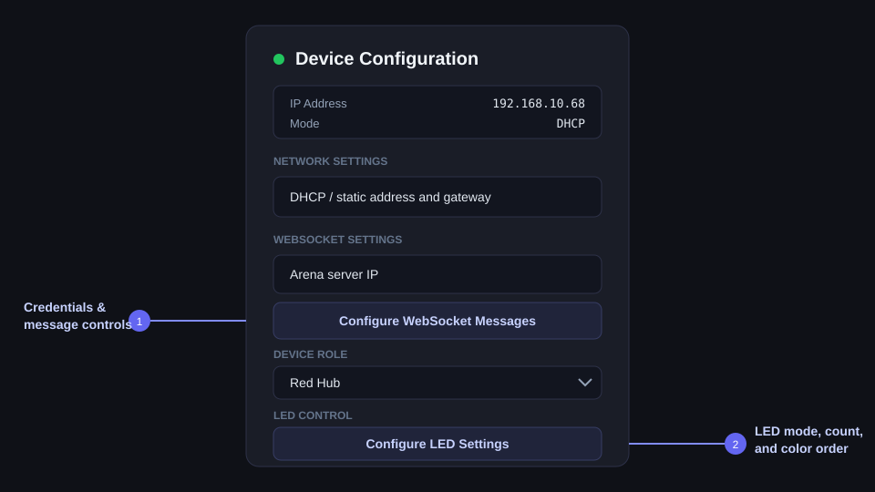
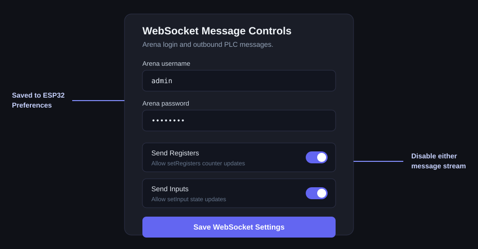
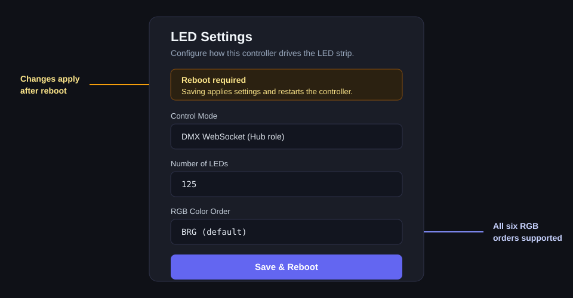

# ESP32-S3 FRC Arena Hub Controller

> [!WARNING]
> **This is a test branch for ESP32 and Hub light control.** It is intended to work only with [Team 254's Cheesy Arena](https://github.com/Team254/cheesy-arena). Hub light control is supported, but `setRegisters` and `setInput` messages do **not** work with that arena.

Firmware for an ESP32-S3 that connects physical FRC hub hardware to a Cheesy Arena server. It reads four hardware counters, reports PLC registers and inputs, responds to PLC coils, controls relays, and drives WS2812B LEDs from coils, DMX, or arena WebSocket modes.

## Highlights

- Four overflow-safe ESP32 PCNT counter channels with 64-bit accumulation
- Red Hub and Blue Hub roles with separate PLC mappings
- W5500 wired Ethernet with DHCP or static addressing
- Arena WebSocket client with automatic reconnect
- Form login and `session_token` cookie authentication for protected arena pages
- Persistent arena username, password, network, role, message, and LED settings
- Coil, direct DMX, and WebSocket LED control
- Locally rendered solid, pulse, startup, advantage, rainbow, and side-test animations
- Browser-based configuration stored in ESP32 Preferences/NVS

## Hardware

| Component | Configuration |
|---|---|
| MCU | ESP32-S3 DevKitM-1 |
| Ethernet | W5500 SPI module |
| LED strip | WS2812B, GPIO 38, up to 300 LEDs |
| Default LED setup | 125 LEDs, BRG color order |
| Relay outputs | GPIO 34 and GPIO 35 |
| Counter inputs | GPIO 15, 1, 2, and 3 |

### W5500 wiring

| Signal | GPIO |
|---|---:|
| SCK | 13 |
| MISO | 12 |
| MOSI | 11 |
| CS | 14 |
| IRQ | 10 |
| RST | 9 |

## Web configuration

After boot, the serial console prints the assigned IP address. Open `http://<device-ip>` in a browser.



The main page configures:

- DHCP or a static IP address and gateway
- Arena WebSocket server IP
- Device role: `redHub` or `blueHub`
- Links to the WebSocket and LED settings pages

Saving the main page restarts the controller.

### WebSocket settings

Open **Configure WebSocket Messages** from the main page.



| Option | Default | Purpose |
|---|---|---|
| Arena username | `admin` | Username posted to the arena `/login` endpoint |
| Arena password | `password` | Password posted to the arena `/login` endpoint |
| Send Registers | Enabled | Sends `setRegisters` counter updates |
| Send Inputs | Enabled | Sends `setInput` sensor updates |

When the protected field-testing WebSocket responds with HTTP 307 or 401, the controller:

1. Posts the saved username and password to `/login`.
2. Extracts the returned `session_token` cookie.
3. Adds the cookie to the next WebSocket upgrade request.
4. Reconnects using the normal retry cycle.

Credentials are stored as plain strings in ESP32 Preferences. Saving this page clears the cached session so updated credentials are used the next time authentication is required.

### LED settings

Open **Configure LED Settings** from the main page.



| Option | Choices |
|---|---|
| Control Mode | Coil, DMX Direct, or DMX WebSocket |
| Number of LEDs | 1–300; default 125 |
| RGB Color Order | RGB, RBG, GRB, GBR, BRG, or BGR; default BRG |

FastLED selects the RGB color order during initialization. The LED page therefore warns the user and performs a **Save & Reboot** so all changes take effect.

## LED control modes

| Mode | Behavior |
|---|---|
| Coil | PLC light coils select the role color; field reset displays green |
| DMX Direct | The ESP32 renders incoming DMX LED data directly |
| DMX WebSocket | `setLedMode.RedMode` and `setLedMode.BlueMode` select locally rendered animations |

### Arena animation modes

The integer values mirror `led/mode.go` in the arena project.

| Value | Mode | ESP32 behavior |
|---:|---|---|
| 0 | Off | All LEDs off |
| 1 | Red | Solid red |
| 2 | Blue | Solid blue |
| 3 | Green | Solid green / field safe |
| 4 | Purple | Solid purple / field cleanup |
| 5 | White | Solid white / scoring assessment |
| 6 | Red Pulse | Pulsing red |
| 7 | Blue Pulse | Pulsing blue |
| 8 | Red Startup | Red startup fill sequence |
| 9 | Blue Startup | Blue startup fill sequence |
| 10 | Red Advantage | Red base with white fixture sweeps |
| 11 | Blue Advantage | Blue base with white fixture sweeps |
| 12 | Rainbow | Rotating 32-position arena rainbow, scaled to the configured strip |
| 13 | Side 1 Test | First quarter in the hub alliance color |
| 14 | Side 2 Test | Second quarter in the hub alliance color |
| 15 | Side 3 Test | Third quarter in the hub alliance color |
| 16 | Side 4 Test | Fourth quarter in the hub alliance color |

For side-test modes, the configured LED count is divided into four contiguous sections. Any remainder is safely included through proportional section boundaries.

## Device roles

| Role | Channel registers | Total | Motor coil | Light coil |
|---|---|---|---|---|
| `redHub` | 3, 4, 5, 6 | 1 | `COIL_RED_HUB_MOTOR` | `COIL_RED_HUB_LIGHT` |
| `blueHub` | 7, 8, 9, 10 | 2 | `COIL_BLUE_HUB_MOTOR` | `COIL_BLUE_HUB_LIGHT` |

Role-specific registers, coils, inputs, counters, and relay pins are defined in `src/role_config.h`.

## WebSocket protocol

The default endpoint is:

```text
ws://10.0.100.5:8080/setup/field_testing/websocket
```

### Outbound register update

Counter values are sent every 500 ms when register sending is enabled.

```json
{
  "type": "setRegisters",
  "data": [
    { "register": 3, "cValue": 42 },
    { "register": 1, "cValue": 42 }
  ]
}
```

### Outbound input update

```json
{
  "type": "setInput",
  "data": [
    { "channel": 0, "state": true }
  ]
}
```

### Inbound coil change

```json
{
  "type": "plcIoChange",
  "data": {
    "Coils": [false, true, false, false]
  }
}
```

### Inbound LED mode

`RedMode` and `BlueMode` are the only data fields. Both are required and must be in the range 0–16.

```json
{
  "type": "setLedMode",
  "data": {
    "RedMode": 12,
    "BlueMode": 3
  }
}
```

## Persistent settings

| Preferences namespace | Stored settings |
|---|---|
| `network` | DHCP/static configuration and LED control mode |
| `role` | Red Hub or Blue Hub role |
| `websocket` | Arena host/port, username/password, and message toggles |
| `leds` | LED count and RGB color order |

## Project structure

```text
src/
├── main.cpp                       Setup, loop, and callbacks
├── role_config.h                  Role-specific mappings and pins
├── counter/                       PCNT hardware counters
├── relay/                         GPIO relay outputs
├── network/                       W5500 Ethernet and network preferences
├── led/                           FastLED strip manager and preferences
├── led_animator/                  Arena-compatible local animations
├── dmx_led/                       Direct DMX LED rendering
├── webserver/                     Device configuration pages
└── websocket/
    ├── ws_manager.cpp             WebSocket, login, cookie, and JSON handling
    ├── coil_map.h                 Seasonal PLC coil assignments
    ├── register_map.h             Seasonal PLC register assignments
    └── input_map.h                Seasonal PLC input assignments
```

## Seasonal updates

Review these files when the arena PLC mapping changes:

| File | Contents |
|---|---|
| `src/websocket/coil_map.h` | Coil indices |
| `src/websocket/register_map.h` | Register indices |
| `src/websocket/input_map.h` | Input indices |
| `src/role_config.h` | Role mappings and physical pins |
| `src/led_animator/led_animator.h` | Arena LED mode integer definitions |

## Build, upload, and monitor

This project uses [PlatformIO](https://platformio.org/).

```bash
# Build
pio run

# Upload
pio run --target upload

# Serial monitor
pio device monitor --baud 115200
```

Key dependencies are declared in `platformio.ini`: FastLED, ESPAsyncWebServer, AsyncTCP, ArduinoJson, WebSockets, and Ethernet. The ESP32 framework supplies HTTPClient for arena form authentication.

## Debug output

Set `DEBUG_SERIAL` in `src/main.cpp` to enable or suppress verbose WebSocket logging:

```cpp
#define DEBUG_SERIAL true
```

Connection, authentication, LED mode, settings, and periodic status messages that use direct `Serial` calls remain visible.

## License

MIT
